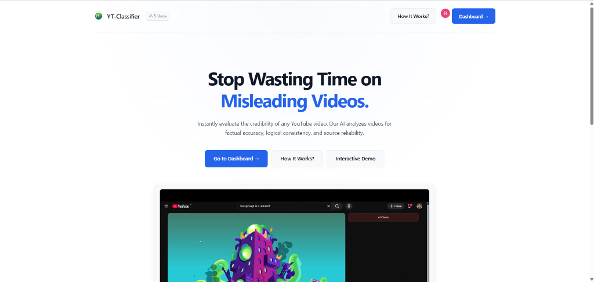
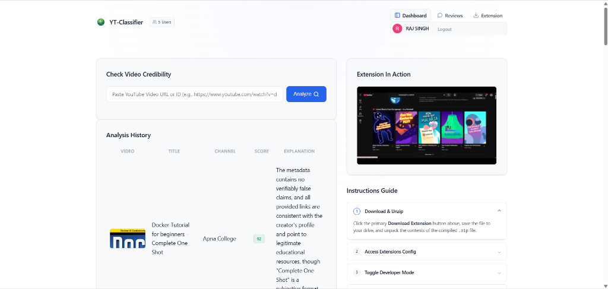
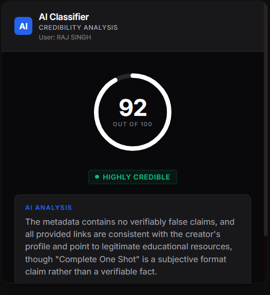

<p align="center">
  
</p>

<h1 align="center">🛡️ YT-Classifier</h1>

<p align="center">
  <strong>AI-Powered YouTube Video Credibility Analyzer</strong><br/>
  <em>Stop wasting time on misleading videos.</em>
</p>

<p align="center">
  <a href="https://ytclassifer.xyz">🌐 Live App</a> &nbsp;•&nbsp;
  <a href="#-how-it-works">📖 How It Works</a> &nbsp;•&nbsp;
  <a href="#-chrome-extension">🧩 Extension</a> &nbsp;•&nbsp;
  <a href="#-getting-started">🚀 Setup</a>
</p>

---

## 🎯 What Is YT-Classifier?

YT-Classifier is a full-stack web application that instantly evaluates the **credibility of any YouTube video**. Paste a link, and the AI analyzes the video's metadata for factual accuracy, logical consistency, bias signals, and source reliability — then returns a clear **score out of 100** with a human-readable explanation.

It's deployed live at **[ytclassifer.xyz](https://ytclassifer.xyz)** and comes with a **Chrome Extension** that brings credibility checks directly onto YouTube, right beside the video you're watching.

---

## ✨ Features

| Feature | Description |
|---|---|
| **AI Credibility Scoring** | Scores videos 0–100 with detailed reasoning using LLM analysis |
| **Heuristic Pre-Filtering** | Automatically skips non-informational content (music, gaming, comedy) to save API calls |
| **Google OAuth2 Login** | One-click sign-in with Google for a secure, personalized experience |
| **Analysis History** | Dashboard with all your previously analyzed videos, scores, and explanations |
| **Chrome Extension (MV3)** | Injects an AI credibility widget directly into the YouTube sidebar |
| **Dynamic Extension Packaging** | Extension `.zip` is generated on-the-fly with your personal auth token baked in |
| **Community Reviews** | Rate and review the platform alongside other users |
| **Redis Caching** | Lightning-fast repeat lookups via distributed Redis cache |
| **Rate Limiting** | Custom rate limiter protects endpoints from abuse |
| **Responsive UI** | Clean, modern interface with animated score gauges and Chart.js trend lines |

---

## 📸 Screenshots

### Landing Page

> The public-facing hero page with a live demo video and clear call-to-action.

<p align="center">
  
</p>

### Dashboard

> Authenticated users can paste any YouTube URL, view their analysis history, download the personalized Chrome extension, and follow the setup guide — all from one screen.

<p align="center">
  
</p>

### Chrome Extension — AI Credibility Widget

> The extension injects a sleek dark-mode widget directly into the YouTube sidebar. It shows the credibility score with an animated circular gauge, a status badge, and the full AI analysis — all without leaving the video.

<p align="center">
  
</p>

### Demo Video

> See the full flow in action:

https://github.com/user-attachments/assets/test.mp4

> *(The demo video is available locally at [`docsStatic/test.mp4`](docsStatic/test.mp4))*

---

## 🔍 How It Works

```
┌──────────────────────────────────────────────────────────────────┐
│  1. User pastes a YouTube URL or Video ID                        │
└───────────────────────────┬──────────────────────────────────────┘
                            ▼
┌──────────────────────────────────────────────────────────────────┐
│  2. Check database cache — already analyzed?                     │
│     ├─ YES → Return cached result instantly                      │
│     └─ NO  → Continue to Step 3                                  │
└───────────────────────────┬──────────────────────────────────────┘
                            ▼
┌──────────────────────────────────────────────────────────────────┐
│  3. Fetch video metadata via YouTube Data API v3                 │
│     (title, description, category, channel name)                 │
└───────────────────────────┬──────────────────────────────────────┘
                            ▼
┌──────────────────────────────────────────────────────────────────┐
│  4. Heuristic category classifier                                │
│     ├─ News / Education / Tech → Send to AI                      │
│     └─ Music / Gaming / Comedy → Score = -1 (Not Informational)  │
└───────────────────────────┬──────────────────────────────────────┘
                            ▼
┌──────────────────────────────────────────────────────────────────┐
│  5. OpenRouter AI evaluates credibility                          │
│     → Returns: Score (0-100) + Explanation                       │
└───────────────────────────┬──────────────────────────────────────┘
                            ▼
┌──────────────────────────────────────────────────────────────────┐
│  6. Result persisted to SQLite, cached in Redis                  │
│     → Displayed on dashboard / Chrome extension widget           │
└──────────────────────────────────────────────────────────────────┘
```

### Score Interpretation

| Score | Badge | Meaning |
|---|---|---|
| **71 – 100** | 🟢 Highly Credible | Content is factually sound with reliable sourcing |
| **41 – 70** | 🟡 Moderate Credibility | Some claims may be unverified or opinions stated as facts |
| **0 – 40** | 🔴 Low Credibility | Significant factual concerns, misleading claims, or poor sourcing |
| **-1** | ⚪ Not Informational | Non-news content (music, gaming, comedy, entertainment) — skipped |

---

## 🧩 Chrome Extension

The Chrome Extension (Manifest V3) brings the full credibility analysis experience **directly onto YouTube**:

<p align="center">
  
</p>

### How to Install

1. **Sign in** at [ytclassifer.xyz](https://ytclassifer.xyz) with Google.
2. Click **"Extension"** in the dashboard navigation bar.
3. A personalized `.zip` file downloads automatically — it has your auth token baked in.
4. Unzip the downloaded file.
5. Open `chrome://extensions` in Chrome → enable **Developer Mode**.
6. Click **"Load unpacked"** → select the unzipped folder.
7. Navigate to any YouTube video — the credibility widget appears in the sidebar.

### Extension Architecture

- **`content.js`** — Listens for YouTube's SPA navigation events (`yt-navigate-finish`, `yt-page-data-updated`) and injects the widget iframe into the `#secondary` sidebar.
- **`popup.html` / `popup.js`** — Renders the credibility score with an animated SVG gauge, status badge, and explanation card.
- **`config.js`** — Dynamically generated at download time with the user's `yid` token and server URL.
- **Dual-Auth Support** — Works via personalized token header (`X-User-Yid`) or browser session cookies.

---

## 🏗️ Architecture

```
┌────────────────────────────────────────────────────────────────────┐
│                            CLIENT LAYER                            │
│                                                                    │
│   ┌──────────────────────────┐   ┌──────────────────────────────┐  │
│   │ Web Dashboard (Thymeleaf)│   │ Chrome Extension (MV3)       │  │
│   │ Chart.js · Vanilla JS    │   │ content.js · popup iframe    │  │
│   └────────────┬─────────────┘   └───────────────┬──────────────┘  │
└────────────────┼─────────────────────────────────┼─────────────────┘
                 │ HTTP / OAuth2                   │ REST + X-User-Yid
                 ▼                                 ▼
┌────────────────────────────────────────────────────────────────────┐
│               SPRING BOOT 4.0.5 (Java 21)                         │
│                                                                    │
│  ┌──────────────────────────────────────────────────────────────┐  │
│  │ Security: OAuth2 · CORS · CSP · Custom Rate Limiter          │  │
│  └──────────────────────────┬───────────────────────────────────┘  │
│  ┌──────────────────────────▼───────────────────────────────────┐  │
│  │ VideoController — Web routes + REST API + ZIP builder         │  │
│  └──────────────────────────┬───────────────────────────────────┘  │
│  ┌──────────────────────────▼───────────────────────────────────┐  │
│  │ VideoService — Heuristic classifier · AI client · Cache mgr  │  │
│  └──────────┬───────────────┬───────────────────┬───────────────┘  │
└─────────────┼───────────────┼───────────────────┼──────────────────┘
              ▼               ▼                   ▼
   ┌──────────────────┐ ┌────────────────┐ ┌─────────────────────┐
   │ SQLite (JPA/ORM) │ │ Redis 7 Cache  │ │ External APIs       │
   │ Users · Videos   │ │ @Cacheable     │ │ • YouTube Data v3   │
   │ Reviews          │ │                │ │ • OpenRouter AI     │
   └──────────────────┘ └────────────────┘ └─────────────────────┘
```

### Tech Stack

| Layer | Technology |
|---|---|
| **Language** | Java 21 |
| **Framework** | Spring Boot 4.0.5 |
| **Security** | Spring Security + Google OAuth2 |
| **ORM** | Spring Data JPA + Hibernate |
| **Database** | SQLite 3 (via `sqlite-jdbc`) |
| **Caching** | Redis 7 (Alpine) via Spring Cache |
| **Templating** | Thymeleaf |
| **Frontend** | Vanilla JS, CSS, Chart.js |
| **Extension** | Chrome Manifest V3 |
| **AI Provider** | OpenRouter (free tier) |
| **Video API** | YouTube Data API v3 |
| **Rate Limiting** | Custom library ([`ratelimiter`](https://github.com/RajSingh-ops/ratelimiter)) |
| **Deployment** | AWS EC2 (t2.micro) + GitHub Actions CI/CD |
| **Containerization** | Docker Compose (Redis) |

---

## 🚀 Getting Started

### Prerequisites

- **Java 21** (Temurin recommended)
- **Maven** (or use the included `mvnw` wrapper)
- **Docker** (for Redis)
- **Google Cloud Console** project with OAuth2 credentials
- **YouTube Data API v3** key
- **OpenRouter** API key

### 1. Clone the Repository

```bash
git clone https://github.com/RajSingh-ops/ytclassifier.git
cd ytclassifier
```

### 2. Configure Environment Variables

Copy the example and fill in your keys:

```bash
cp .env.example .env
```

Required variables:

| Variable | Purpose |
|---|---|
| `OPENROUTER_API_KEY` | API key for OpenRouter LLM inference |
| `YOUTUBE_API_KEY` | Google Cloud API key for YouTube Data API v3 |
| `CLIENT_ID` | Google OAuth2 Client ID |
| `CLIENT_SECRET` | Google OAuth2 Client Secret |
| `REDIS_HOST` | Redis host address (default: `localhost`) |

### 3. Start Redis

```bash
docker-compose up -d
```

### 4. Build & Run

```bash
./mvnw clean package -DskipTests
java -jar target/ytclassifier-0.0.1-SNAPSHOT.jar
```

The application starts at **http://localhost:8080**.

---

## 🔐 Authentication Flow

YT-Classifier uses a **dual-path authentication** system to support both web browsers and the Chrome extension:

```
                  ┌─────────────────────────────────┐
                  │ Request to /api/video/{videoId}  │
                  └──────────────┬──────────────────┘
                                 │
                  Has 'X-User-Yid' header?
                                 │
                   ├── YES ──────┴────── NO ───┐
                   ▼                           ▼
         ┌───────────────────┐     ┌──────────────────────┐
         │ Lookup user by    │     │ Check OAuth2 session  │
         │ yid token in DB   │     │ (JSESSIONID cookie)   │
         └────────┬──────────┘     └──────────┬───────────┘
                  │                           │
           Found? │                  Authenticated?
                  │                           │
           ├─ ✅ ─┴─ ❌ ──┐           ├─ ✅ ──┴── ❌ ──┐
           ▼              ▼           ▼               ▼
    ┌─────────────┐ ┌──────────┐ ┌─────────────┐ ┌──────────────┐
    │ Proceed ✓   │ │ Fallback │ │ Proceed ✓   │ │ 401 Error    │
    │             │ │ to OAuth │ │             │ │ Unauthorized │
    └─────────────┘ └──────────┘ └─────────────┘ └──────────────┘
```

Each user gets a unique 6-character `yid` token (cryptographically generated) that the Chrome extension uses for stateless authentication via the `X-User-Yid` header.

---

## 📂 Project Structure

```
ytclassifier/
├── src/main/java/com/ytclass/ytclassifier/
│   ├── YtclassifierApplication.java          # Spring Boot entry point
│   ├── config/
│   │   ├── SecurityConfig.java               # OAuth2, CORS, CSP, rate limiting
│   │   ├── WebConfig.java                    # MVC configuration
│   │   └── DatabaseInitializer.java          # Dynamic schema migration
│   ├── controller/
│   │   ├── VideoController.java              # All routes + REST API + ZIP builder
│   │   └── GlobalExceptionHandler.java       # Centralized error handling
│   ├── model/
│   │   ├── User.java                         # User entity (Google OAuth2)
│   │   ├── Video.java                        # Video entity (credibility data)
│   │   └── Review.java                       # Community review entity
│   ├── repository/
│   │   ├── UserRepository.java
│   │   ├── VideoRepository.java
│   │   └── ReviewRepository.java
│   └── service/
│       └── VideoService.java                 # Core AI analysis + YouTube API
├── src/main/resources/
│   ├── application.properties                # Spring configuration
│   ├── templates/                            # Thymeleaf HTML views
│   │   ├── landing.html                      # Public landing page
│   │   ├── index.html                        # Authenticated dashboard
│   │   ├── how-it-works.html                 # Feature explanation
│   │   ├── review.html                       # Community reviews
│   │   ├── privacy.html / terms.html         # Legal pages
│   │   └── base.html                         # Layout template
│   ├── static/                               # CSS, JS, media assets
│   │   ├── spa.css
│   │   ├── app.js
│   │   ├── logo.png
│   │   └── test.mp4                          # Demo video
│   └── extension/                            # Chrome Extension source
│       ├── manifest.json
│       ├── content.js
│       ├── popup.html / popup.js
│       └── config.js
├── docsStatic/                               # Documentation assets
│   ├── landing-page.png
│   ├── dashboard.png
│   ├── extension-popup.png
│   └── test.mp4
├── docker-compose.yml                        # Redis container
├── pom.xml                                   # Maven dependencies
├── .env.example                              # Environment template
└── .github/workflows/deploy.yml              # CI/CD pipeline
```

---

## 🗄️ Database Schema

```
┌──────────────────────────┐                  ┌──────────────────────────┐
│         users            │                  │         videos           │
├──────────────────────────┤                  ├──────────────────────────┤
│ email       TEXT [PK]    │◄─────┐           │ videoId     TEXT [PK]    │◄─────┐
│ name        TEXT         │      │           │ title       TEXT         │      │
│ googleId    TEXT [UNIQUE]│      │           │ channelName TEXT         │      │
│ yid         TEXT [UNIQUE]│      │           │ credibilityScore INT    │      │
│ pictureUrl  TEXT         │      │           │ explanation  TEXT (LOB)  │      │
│ provider    TEXT         │      │           │ createdAt   DATETIME     │      │
│ createdAt   DATETIME     │      │           └────────────┬─────────────┘      │
│ lastLogin   DATETIME     │      │                        │                    │
└──────────────────────────┘      │    ┌────────────────────┴────┐              │
                                  │    │      user_videos        │              │
                                  └────┤ user_email  TEXT [FK]   │              │
┌──────────────────────────┐           │ video_id    TEXT [FK]   ├──────────────┘
│         reviews          │           └─────────────────────────┘
├──────────────────────────┤
│ id          INTEGER [PK] │
│ userName    TEXT          │
│ userEmail   TEXT          │
│ userPicture TEXT          │
│ comment     TEXT          │
│ rating      INTEGER (1-5)│
│ createdAt   DATETIME     │
└──────────────────────────┘
```

---

## 🔌 API Endpoints

| Method | Endpoint | Auth | Description |
|---|---|---|---|
| `GET` | `/` | Public | Landing page |
| `GET` | `/index` | Auth / Public | User dashboard |
| `GET` | `/api/video/{videoId}` | Auth (Session or `X-User-Yid`) | **Core API** — Analyze a video |
| `GET` | `/ytclassifier-extension.zip` | Auth | Download personalized Chrome extension |
| `GET` | `/review` | Public (Rate Limited) | Community reviews page |
| `POST` | `/review/add` | Auth | Submit a review |
| `GET` | `/how-it-works` | Public | How it works page |
| `GET` | `/privacy` | Public | Privacy policy |
| `GET` | `/terms` | Public | Terms of service |
| `POST` | `/logout` | Auth | Sign out |

---

## 🚢 Deployment

The project deploys via **GitHub Actions** to an **AWS EC2 (t2.micro)** instance:

1. **Build** — Maven packages a fat JAR with all templates and static assets bundled.
2. **Verify** — Pipeline inspects the JAR contents and computes SHA-256 checksum.
3. **Provision** — SSH into EC2, ensure JDK 21 + Docker + Redis are running.
4. **Transfer** — SCP the JAR, verify checksum integrity on the server.
5. **Deploy** — Stop old process, start new JAR with memory-optimized JVM flags:
   ```bash
   java -Xmx384m -Xms128m -XX:+UseSerialGC -jar app.jar
   ```
6. **Health Check** — Poll `http://localhost:8080` for up to 120 seconds until healthy.

---

## 🤝 Contributing

Contributions are welcome! Feel free to open issues or submit pull requests.

---

## 📄 License

This project is open source. See the repository for license details.

---

<p align="center">
  <strong>Built with ❤️ by <a href="https://github.com/RajSingh-ops">Raj Singh</a></strong>
</p>
